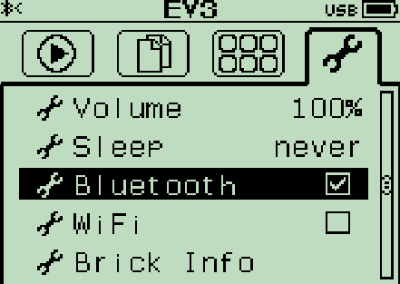
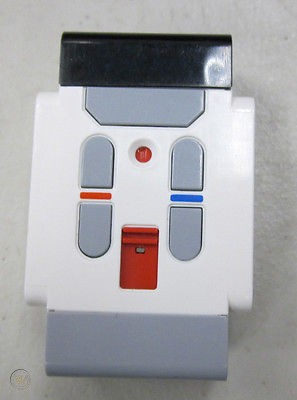

# Mindstorms EV3 Adapters Sample

This sample provides an example usage of the EV3 adapters, allowing the demo robot to be remotely controlled with the IR transmitter included in the robot set.
The included adapters can control and read sensor information from a Mindstorms EV3 brick over Bluetooth, using direct commands from the third-party J4EV3 library.

# Readme Contents

* [Setup](#Setup)
* [Using This Sample](#Using-This-Sample)
* [Adapter Documentation](#EV3-Adapter-Documentation)
	* [Connection Manager](#Connection-Manager)
	* [Status Adapter](#Status-Adapter)
	* [Command Adapter](#Command-Adapter)

# Setup
* Version: StreamBase Studio 10.6 or compatible
* This project requires the J4EV3 library. Download the jar file with dependencies here: https://github.com/LLeddy/J4EV3/blob/master/J4EV3/build/J4EV3WithDependencies.jar
* Add it to your local maven repository with the following command:
	`$ mvn install:install-file -Dfile="<PATH TO JAR FILE>J4EV3WithDependencies.jar" -DgroupId="github.LLeddy" -DartifactId="J4EV3" -Dversion="17.7.26" -Dpackaging="jar"`
	* Be sure to replace `<PATH TO JAR FILE>` with the path to your file. For more information on this step, see [here](https://maven.apache.org/guides/mini/guide-3rd-party-jars-local.html).
* In your EV3's Settings tab, ensure that Bluetooth and Visibility are enabled.
	
	
* In your computer's Bluetooth settings, add the EV3 as a paired device. This step varies according to OS; see [the LEGO help page on this topic](https://www.lego.com/en-us/service/help/EKB_MINDSTORMS_Email_Form/connecting-your-lego-mindstorms-ev3-to-bluetooth-kA009000001dcjjCAA) for detailed steps.
* In your computer's devices properties, find the EV3 brick's Bluetooth MAC address. This 12-digit address needs to be entered in the Connection adapter's operator properties.
* You may now proceed to the demo or begin programming with the adapters.

# Using This Sample

This sample is designed to work with the TRACK3R demo bot. It allows the IR beacon included in the kit to work as a remote control for tank driving. Building instructions for TRACK3R are enclosed in every MINDSTORMS kit, or can be found [online here](https://www.lego.com/cdn/product-assets/product.bi.core.pdf/6124045.pdf).

* Build the TRACK3R demo bot.
* Open Demo.sbapp in src/main/eventflow and double click the Connection adapter. In the Operator Properties tab, fill in the Bluetooth MAC address of the EV3 brick used in the robot.
* Turn on the EV3 brick by pressing the central button. Wait until the robot has booted up fully (it will make a sound and the LED will turn green).
* Run Demo.sbapp as an EventFlow fragment. When the demo is connected to the EV3 brick, its light will turn orange.
* Ensure that the IR beacon has the red switch pushed all the way forwards, into position "1".
	
* Place the robot on a flat surface that's safe to drive around on. Point the black end of the IR beacon towards the robot's IR sensor and begin controlling the robot by pressing the grey buttons.

# EV3 Adapter Documentation

There are three adapters included in this project. A Connection Manager is required on the EventFlow canvas before either the Status Adapter (an input adapter) or Command Adapter (an output adapter) will work.
* [Connection Manager](#Connection-Manager)
* [Status Adapter](#Status-Adapter)
* [Command Adapter](#Command-Adapter)

## Connection Manager

This adapter handles the bluetooth connection to the robot at startup, letting the Status and Control adapters connect to the same robot by the control adapter's name. Any number of Status and Command adapters may share a connection to the same Connection Manager.

#### Properties
* Bluetooth Mac address for connected EV3 brick (12-character string)

#### Output Ports
* Status: Emits once on startup after a successful Bluetooth connection.
	* Success, boolean.

## Status Adapter

This adapter allows the user to request sensor or motor status information from each device plugged into the EV3 brick.
See the [j4ev3 documentation](https://github.com/LLeddy/J4EV3/blob/master/J4EV3/src/com/j4ev3/core/Sensor.java) for the expected valid min/max values, or the [EV3 dev docs](https://docs.ev3dev.org/projects/lego-linux-drivers/en/ev3dev-jessie/sensor_data.html#lego-ev3-us) for detailed explanation of the sensor modes & units.

#### Properties
* Set up the properties in the Robot Configuration tab first. Check your EV3 to see which physical ports have a sensor or a motor connected.
* In the Adapter properties tab, type the name of the Connection Manager whose connection you want to share.
* Choose an output type from the dropdown list.
	* Raw: the raw sensor value, as a float.
	* SI: the value converted to real-world units, as a float.
	* Percent: the value represented as a percentage of possible values, 0-100, as an integer.
* Choose which ports to stream information from on startup. If not constantly streaming information, single data points can be requested via the input ports.

#### Input Ports
* Device Control Port: requests a tuple of sensor readings from a connected device.
	* TargetPort, string. Choose from A, B, C, D, 1, 2, 3, or 4.
	* Mode, string. (Optional but reccommended for fastest rates and most accurate data. Choose from the schema field names listed under "Output Ports" below or "*" for all fields. All other fields will be null.)
	* StreamOn, boolean. (Optional. Starts or stops the continuous stream of data from this port.)
* Button Control Port
	* Any incoming tuple will request a tuple containing the status of the buttons on the EV3 brick.

#### Output Ports
The number of output ports is variable depending on what is set in the robot configuration properties. The possible output schemae are these:
* Motor schema
	* Degrees
	* Rotation
	* Speed
* Touch schema
	* Touch
	* Bumped (# of times the button has been pressed and released)
* Color schema
	* Color (String, available values: NONE, BLACK, BLUE, GREEN, YELLOW, RED, WHITE, BROWN)
	* ReflectedIntensity
	* AmbientIntensity
* Ultrasonic schema
	* DistCM
	* DistIN
	* Listen (boolean)
* Gyroscope schema
	* Angle
	* Rate
* IR schema
	* Proximity
	* Remote (an integer corresponding to remote control's beacon pattern)
* Button schema
	* LeftButton, string (available values: RELEASED, PRESSED, BUMPED)
	* CenterButton, string (see above)
	* RightButton, string (see above)
	* UpButton, string (see above)
	* DownButton, string (see above)

## Command Adapter

Sends commands to any of the four motors to control the robot's motion. This adapter can also control the colored status LED in the EV3 brick.

#### Properties
* In the Adapter properties tab, type the name of the Connection Manager whose connection you want to share.
* Set the acceptable motor position error (in degrees) for blocking motor commands to be considered a success.

#### Input Ports
* Non-Blocking Motor Control Port: This changes a motor's operating state until another command is recieved.
	* RunMode, string. Available values STOP, BRAKE, POWER, SPEED. Brake holds the motor in position, but Stop stops all power to it.
	* TargetPort, string. (Choose from A, B, C, D.)
	* Rate, integer. (Serves as the value to run at for the POWER or SPEED commands. Can be negative to make the motor run the other direction.)
* Blocking Motor Control Port: This moves the motor to a designated position or for a designated amount of time before stopping. Any two 2 of the 3 integer fields must be filled; if all 3 are filled out, the last value will be ignored.
	* TargetPort, string. (Choose from A, B, C, D.)
	* Position, integer.
	* Time, integer.
	* Rate, integer.
* LED Control Port: Controls the LED embedded in the EV3 brick.
	* On, boolean
	* Color, string. (Available values RED, ORANGE, GREEN)
	* Blink, boolean (optional)

#### Output Ports
Only blocking motor commands emit an acknowledgement tuple after execution. The tuple contains all fields from the command given, plus a report of the actual position and whether or not the command was a "success".
	* TargetPort, string. (Choose from A, B, C, D.)
	* Position, integer.
	* PositionActual, integer.
	* Time, integer.
	* Rate, integer.
	* Success, boolean.